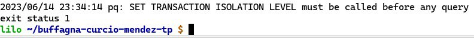

= Bases de Datos 1: Trabajo Práctico
== Primer Semestre 2023
v1, {docdate}. 
*Integrantes*

Buffagna Maria_Carla <mcarlabuff@gmail.com>; Curcio Matias <juanmatiascurcio@gmail.com>; Mendez Agustina <agustina.996@hotmail.com>

*Docentes*

Hernan Rondelli y Daniel Bertaccini

:title-page:
:numbered:
:source-highlighter: coderay
:tabsize: 4

== Introducción

El siguiente trabajo consiste en un sistema para almacenar información relativa a la administración de turnos médicos.

El sistema permitirá asignar turnos, mantener toda la información de los pacientes, mediques, cobertura de las obras sociales, controlar que los turnos se asignen correctamente y administrar las liquidaciones
mensuales de las atenciones realizadas por cada obra social.

Para esto se crea una base de datos utilizando postgresSQL, y también se implementa una base de datos BoltDB basada en JSON.

== Descripción

Durante el desarrollo del trabajo, nos fuimos encontrando con distintas dificultades:
	
* Para comenzar, iniciamos la creación de tablas, la logica para agregar y borrar PKs y FKs e la insercion de datos en las tablas en un mismo archivo sql. Esto dificulto el trabajo en equipo, por lo cual decidimos separar las acciones en diferentes archivos. Este cambio, nos permitió trabajar de manera mas ordenada en Go.
* Tuvimos que investigar el uso de timestamp para poder obtener solo los datos necesarios. 

* *Generar los turnos disponibles*: Luego de realizar una primer generación de turnos, los turnos siguientes se intentaban insertar nuevamente desde el inicio con nro_turno = 1. Primeramente lo solucionamos agregando logica para verificar cual era la ultima fila de la tabla y a partir de alli insertar los nuevos numeros de turno. 

[source, c]
----	
	cant_de_turnos_cargados := (select count (*) from turno);
	if cant_de_turnos_cargados != 0 then
		nro_turno := cant_de_turnos_cargados + 1;
	else
		nro_turno:=1;
	end if;
.
.
.
----
	
Esta solución puede fallar si se borran filas de la tabla, por ejemplo. Por lo que decidimos usar serial para el número de turno.

* //Falta explicar algun problema con los mails? o con liquidaciones?
* *Transacciones*: Para evitar que se asigne el mismo turno a dos pacientes diferentes, es necesario el uso de transacciones. Esto nos generó un problema donde no pudimos encontrar solución 

Se agregaron instancias de datos que permitan testear el sistema. 
La base de datos se implementa sobre la postgresSQL.
//NO ME CONVENCE REDACCION 
//La carga de datos y el desarrollo del sistema (parte lógica) se realizan en el leguaje de programación SQL. 
//Con lo cual se desarrollo, utilizando el lenguaje de programación GO, un menú con las opciones de las funciones a ejecutar por el sistema.  
También, se puede incluir una descripción general del programa—cómo
funciona.

En esta sección pueden incluirse las dificultades que tuvieron, las
soluciones encontradas, las decisiones que se fueron tomando a lo largo
del trabajo práctico, y las cuestiones de diseño que consideren
importantes.

== Implementación

Carpeta: funciones ::
//FALTAN AGREGAR LO D ELOS TRIGGERS, ERRORES Y DEMÁS ARCHIVOS
En esta carpeta se encuentran todos los stored procedures y triggers desarrollados en lenguaje SQL. 
 * creación_de_tablas.sql: crea todas las tablas que se utilizan en el sistema.
 * add_PKs_FKs.sql: agrega todas las Primary keys y Foreign Keys de todas las tablas, según las condiciones y relaciones que se deben cumplir entre los datos.
 * borrar_PK_FK.sql: elimina todas las Primary keys y Foreign Keys de las tablas. 
 * carga_valores.sql: introduce todos los datos en las diferentes tablas utilizados para este trabajo.
 * generacion_de_turnos_disponibles.sql: crea la función Generar_turnos_disponibles(int,int) que recibe el año y mes de los turnos que se quieren generar y retorna un booleano indicando si fue posible la operación.
  Esta función genera todos los turnos de les mediques para el mes indicado, según la agenda de turnos ya indicada. 
 * reservar_turno.sql: crea la función Reservar_turno(int,int,timestamp) que recibe como parámetro el número de paciente, DNI del medique, fecha y hora del turno a resrevar.
  Devuelve un booleano indicando si se pudo realizar la reserva, en caso de que se concrete la reserva el turno se indica en la tabla turno como reservado y se envía un email al paciente. 

	[source, c]
	----	
	create or replace function Generar_turnos_disponibles(anio int, mes int) returns boolean as $$
	declare
		turnos_en_fecha record;
		nro_turno int;
		aux_horario time;
		a agenda%rowtype;
		
		fecha_aux_inicio timestamp := date_trunc('month', make_date(anio,mes,1));
		fecha_aux_final timestamp := fecha_aux_inicio + interval '1 month' - interval '1 day';
		fecha_aux_actual timestamp;
		
		cant_de_turnos_cargados int;
		
	begin 
		--Si hay turnos creados para ese año y mes, devuelve false.
		if exists (
			select * from turno where 
			((select extract (year from turno.fecha))= anio and (select extract (month from turno.fecha)) = mes)
		) then return false;
		end if;
		
		for a in select * from agenda loop 
			
			fecha_aux_actual:= fecha_aux_inicio;
			
			while fecha_aux_actual <= fecha_aux_final loop
				
				if (select extract (isodow from fecha_aux_actual)) = a.dia then
					aux_horario:= a.hora_desde;
					while aux_horario <= a.hora_hasta - a.duracion_turno loop
				
							insert into turno (fecha, nro_consultorio, dni_medique,nro_paciente,nro_obra_social_consulta,nro_afiliade_consulta,monto_paciente,monto_obra_social,f_reserva,estado) 
												values(fecha_aux_actual + aux_horario, a.nro_consultorio, a.dni_medique, null, null, null, null, null, null, 'disponible');
							nro_turno:= nro_turno +1; 
							aux_horario := aux_horario + a.duracion_turno;
					
					end loop;
				end if;
				fecha_aux_actual=fecha_aux_actual + interval '1 day';
				
			end loop;
			
		end loop;
		return true;
		
	end;
	$$ language plpgsql;
	.
	.
	.
	----
 
 * atención_de_turno.sql: crea la función Atencion_de_turno(int) que recibe como parámetro el número del turno que se desea atender y retorna un booleano indicando si se pudo realizar elprocedimiento.
  Esta función marca como atendido el turno indicado si coincide con lafecha actual, en caso contrario se cargan los errores en la tabla error.
	[source, c]
	----	
	create or replace function Atencion_de_turno(turno_nro int) returns boolean as $$
	declare
		t turno%rowtype;
		fecha_actual timestamp := current_date + current_time ;
		
	begin
		select * from turno into t where turno_nro = turno.nro_turno;
		
			if not found then
				insert into error (f_turno, nro_consultorio, dni_medique, nro_paciente, operacion, f_error, motivo) 
									values (t.fecha, t.nro_consultorio, t.dni_medique, t.nro_paciente, 'atención', fecha_actual, 'número de turno no válido');
				raise 'número de turno no válido'; 
				return false;
			else 
				if  not (t.estado = 'reservado') then
					insert into error (f_turno, nro_consultorio, dni_medique, nro_paciente, operacion, f_error, motivo) 
									values (t.fecha, t.nro_consultorio, t.dni_medique, t.nro_paciente, 'atención', fecha_actual, 'turno no reservado');
					raise 'turno no reservado'; 
					return false;
				else
					if not (t.fecha::date = current_date) then
						insert into error (f_turno, nro_consultorio, dni_medique, nro_paciente, operacion, f_error, motivo) 
									values (t.fecha, t.nro_consultorio, t.dni_medique, t.nro_paciente, 'atención', fecha_actual, 'turno no corresponde a la fecha del día');
						raise 'turno no corresponde a la fecha del dia';
						return false;
					else
						update turno set estado = 'atendido' where turno.nro_turno = turno_nro;
						return true;
					end if;
				end if;
			end if;
			
		
	end;
	$$ language plpgsql;
	.
	.
	.
	----

 * liquidacion_para_obras_sociales.sql: crea la función liquidacion_para_obras_sociales(int, int, int) que recibe como parámetrosel mes, anio y el número de la obra social de la liquidación a realiar.
  Retorna el monto tortal a liquidar. Se generá la liquidación una vez por mes, en caso de no haber liquidado aquellos turnos que figuren como atendidos se liquidaron, además se cargan los datos correspondientes a la liquidacion total en la tabla liquidacion_cabecera y el datalle de cada atención a liquidar de cada turno en la tabla liquidacion_detalle.
	[source, c]
	----	
	create or replace function Liquidacion_para_obras_sociales(anio int, mes int, numero_obra_social int) returns decimal as $$
	declare

		t_aux turno%rowtype;
		medique_aux medique%rowtype;
		paciente_aux paciente%rowtype;
		fecha_aux_inicio date := date_trunc('month', make_date(anio,mes,1));
		fecha_aux_final date := fecha_aux_inicio + interval '1 month' - interval '1 day';
		monto_liquidacion decimal(15,2);
		nro_liquidacion_aux int;
		
	begin
		-- si ya esta liquidado
		if exists (
			select * from turno where 
				(turno.fecha ::date >= fecha_aux_inicio  and turno.fecha ::date <= fecha_aux_final 
				and turno.nro_obra_social_consulta=numero_obra_social and turno.estado='liquidado')
			) then return 0;
		end if;
		
		-- en caso que no este liquidado
		insert into liquidacion_cabecera (nro_obra_social, desde, hasta, total) values
				(numero_obra_social, fecha_aux_inicio, fecha_aux_final, monto_liquidacion); --se crea la liquidacion 
				
		nro_liquidacion_aux = (SELECT MAX(nro_liquidacion) from liquidacion_cabecera) :: int;
		
		monto_liquidacion = 0;	
			
		for t_aux in select * from turno where turno.nro_obra_social_consulta = numero_obra_social and turno.estado='atendido' loop
															
			if (t_aux.fecha ::date >= fecha_aux_inicio  and t_aux.fecha ::date <= fecha_aux_final) then
				
				select * into medique_aux from medique where t_aux.dni_medique=medique.dni_medique;

				select * into paciente_aux from paciente where t_aux.nro_paciente=paciente.nro_paciente;
				
				update turno set estado='liquidado' where turno.nro_turno=t_aux.nro_turno;
				
				insert into liquidacion_detalle (nro_liquidacion,f_atencion,nro_afiliade, dni_paciente, nombre_paciente, 
					apellido_paciente, dni_medique,nombre_medique, apellido_medique,especialidad, monto)
					values(nro_liquidacion_aux,t_aux.fecha :: date, t_aux.nro_afiliade_consulta, paciente_aux.dni_paciente, paciente_aux.nombre, 
					paciente_aux.apellido,t_aux.dni_medique, medique_aux.nombre, medique_aux.apellido,medique_aux.especialidad, 
					t_aux.monto_obra_social);
					
				monto_liquidacion = monto_liquidacion + t_aux.monto_obra_social; 
				
			end if;	
		
		end loop;
		
		update liquidacion_cabecera set total=monto_liquidacion where liquidacion_cabecera.nro_liquidacion=nro_liquidacion_aux;
						
		alter sequence liquidacion_detalle_nro_linea_seq restart with 1;  --se reestablece el serial de nro_linea 
		
		return monto_liquidacion;
		
	end;
	$$ language plpgsql;
	.
	.
	.
	----

En esta sección se incluye el código fuente correctamente formateado—y
comentado, si corresponde.

Además, por cada fragmento de código
relevante—i.e. función, método, procedimiento—se debe dar una
breve descripción, decir qué hace, y especificar los parámetros que
toma la función/método/procedimiento, junto con los valores que devuelve
ó modifica.

_No debería incluirse el código de librerías/frameworks que se
utilicen—a no ser que sea absolutamente necesario._

== Conclusiones

El presente trabajo presentó un gran desafío para todos. Pudimos mejorar y desarrollar habilidades sobre el manejo de base de datos y los diferentes lenguajes de programacion utlizados.

Problemas::
 * Utilización de diferentes tipos de datos en los distintos lenguajes. 
 * Utilización de PERFORM en lugar de SELECT. 
 * Orden del código y ejecución de las diferentes sentencias. 
 * 
 * Transactions 

Aquí van algunas reflexiones acerca del proceso de desarrollo del
trabajo realizado, y de los resultados obtenidos.

También se puede incluir una conclusión final de producto terminado.

Pueden incluirse lecciones aprendidas durante el desarrollo del trabajo.
