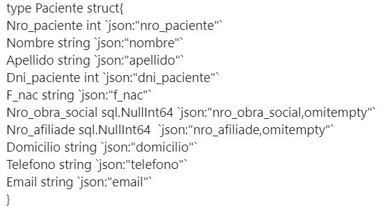

= Bases de Datos 1: Trabajo Práctico
== Primer Semestre 2023
v1, {docdate}. 
*Integrantes*

Buffagna Maria_Carla <mcarlabuff@gmail.com>; Curcio Matias <juanmatiascurcio@gmail.com>; Mendez Agustina <agustina.996@hotmail.com>

*Docentes*

Hernan Rondelli y Daniel Bertaccini

:title-page:
:numbered:
:source-highlighter: coderay
:tabsize: 4

== Introducción

El siguiente trabajo consiste en un sistema para almacenar información relativa a la administración de turnos médicos.

El sistema permitirá asignar turnos, mantener toda la información de los pacientes, mediques, cobertura de las obras sociales, controlar que los turnos se asignen correctamente y administrar las liquidaciones
mensuales de las atenciones realizadas por cada obra social.

Para esto se crea una base de datos utilizando postgresSQL, y también se implementa una base de datos BoltDB basada en JSON.

== Descripción

Durante el desarrollo del trabajo, nos fuimos encontrando con distintas dificultades:
	
* Para comenzar, iniciamos la creación de tablas, la logica para agregar y borrar PKs y FKs e la insercion de datos en las tablas en un mismo archivo sql. Esto dificulto el trabajo en equipo, por lo cual decidimos separar las acciones en diferentes archivos. Este cambio, nos permitió trabajar de manera mas ordenada en Go.
* Tuvimos que investigar el uso de timestamp para poder obtener solo los datos necesarios. 
* También tuvimos problemas con los triggers, tuvimos que investigar más a fondo como funcionaban. Buscábamos si existía algún tipo de trigger temportal, pero no encontramos nada de eso. Decidimos dejar el envío de mails diarios de forma manual, ejecutando lla procedure correspondiente.
* Interpretar como manejar la conexión entre go y psql fue un gran desafío, el principal problema fue que no entendíamos como pasarle parámetros desde go a una query de sql, pero con la ayuda del profe Daniel pudimos avanzar con eso, y a medida que trabajabamos se hacía todo un poco más ameno.
* *Generar los turnos disponibles*: Luego de realizar una primer generación de turnos, los turnos siguientes se intentaban insertar nuevamente desde el inicio con nro_turno=1. Primeramente lo solucionamos agregando logica para verificar cual era la ultima fila de la tabla y a partir de alli insertar los nuevos numeros de turno. 

[source, c]
----	
	cant_de_turnos_cargados := (select count (*) from turno);
	if cant_de_turnos_cargados != 0 then
		nro_turno := cant_de_turnos_cargados + 1;
	else
		nro_turno:=1;
	end if;

----
	
Esta solución puede fallar si se borran filas de la tabla, por ejemplo. Por lo que decidimos usar serial para el número de turno.

* *Transacciones*: Para evitar que se asigne el mismo turno a dos pacientes diferentes, es necesario el uso de transacciones. Esto nos generó un problema donde no pudimos encontrar solución 

.Error en transacciones
image::errorTransacciones.jpg[]

* *BoltDB*: Para recuperar los datos de las tablas y hacer el marshalling de Go a JSON, tuvimos problemas con los valores nulos de los pacientes sin obra social.
	
.Paciente

	
Se solucionó utilizando any para descartar los valores nulos
	
[source, c]
----
type Paciente struct{
		Nro_paciente int `json:"nro_paciente"`
		Nombre string `json:"nombre"`
		Apellido string `json:"apellido"`
		Dni_paciente int `json:"dni_paciente"`
		F_nac string `json:"f_nac"`
		Nro_obra_social any `json:"nro_obra_social,omitempty"`
		Nro_afiliade any  `json:"nro_afiliade,omitempty"`
		Domicilio string `json:"domicilio"`
		Telefono string `json:"telefono"`
		Email string `json:"email"`	
}
----

Se agregaron instancias de datos que permitan testear el sistema. 
La base de datos se implementa sobre la postgresSQL.
//NO ME CONVENCE REDACCION 
Se utiliza el lenguaje de programación PSQL para llevar a cabo la carga de datos y el desarrollo de la parte lógica del sistema. Además, creamos un menú utilizando el lenguaje de programación GO, que contiene distintas opciones elegibles para correr distintas las funcionalidades del sistema.

//También, se puede incluir una descripción general del programa—cómo funciona.

//En esta sección pueden incluirse las dificultades que tuvieron, las
//soluciones encontradas, las decisiones que se fueron tomando a lo largo
//del trabajo práctico, y las cuestiones de diseño que consideren
//importantes.

== Implementación

Carpeta: archivosSQL ::
//FALTAN AGREGAR LO D ELOS TRIGGERS, ERRORES Y DEMÁS ARCHIVOS
En esta carpeta se encuentran todos los stored procedures y triggers desarrollados en lenguaje SQL. 
 * _creación_tablas.sql_: crea todas las tablas que se utilizan en el sistema.
 * _add_PKs_FKs.sql_: agrega todas las Primary keys y Foreign Keys de todas las tablas, según las condiciones y relaciones que se deben cumplir entre los datos.
 * _borrar_PK_FK.sql_: elimina todas las Primary keys y Foreign Keys de las tablas. 
 * _carga_valores.sql_: introduce todos los datos en las diferentes tablas utilizados para este trabajo.
 * _cancelar_turnos_.sql : crea la funcion Cancelar_turnos(int,date,date) que recibe el dni del medique y dos fechas para marcar un rango de fechas, y cancela todos los turnos que tiene ese médique en ese rango de fechas. Devuelve la cantidad de turnos cancelados.
 * _test_reservas_.sql : introduce en la tabla solicitud_reservas unas reservas que seleccionamos nosotros en forma de prueba, y las reserva con la function reservar_turno().
 * _generacion_de_turnos_disponibles.sql_: crea la función Generar_turnos_disponibles(int,int) que recibe el año y mes de los turnos que se quieren generar y retorna un booleano indicando si fue posible la operación. Esta función genera todos los turnos de les mediques para el mes indicado, según la agenda de turnos ya indicada. 
	
[source, c]
----
create or replace function Generar_turnos_disponibles(anio int, mes int) returns boolean as $$
declare
	turnos_en_fecha record;
	nro_turno int;
	aux_horario time;
	a agenda%rowtype;
	
	fecha_aux_inicio timestamp := date_trunc('month', make_date(anio,mes,1));
	fecha_aux_final timestamp := fecha_aux_inicio + interval '1 month' - interval '1 day';
	fecha_aux_actual timestamp;
	
	cant_de_turnos_cargados int;
	
begin 
	--Si hay turnos creados para ese año y mes, devuelve false.
	if exists (
		select * from turno where 
		((select extract (year from turno.fecha))= anio and (select extract (month from turno.fecha)) = mes)
	) then return false;
	end if;
	
	for a in select * from agenda loop 
		
		fecha_aux_actual:= fecha_aux_inicio;
		
		while fecha_aux_actual <= fecha_aux_final loop
			
			if (select extract (isodow from fecha_aux_actual)) = a.dia then
				aux_horario:= a.hora_desde;
				while aux_horario <= a.hora_hasta - a.duracion_turno loop
			
						insert into turno (fecha, nro_consultorio, dni_medique,nro_paciente,nro_obra_social_consulta,nro_afiliade_consulta,monto_paciente,monto_obra_social,f_reserva,estado) 
											values(fecha_aux_actual + aux_horario, a.nro_consultorio, a.dni_medique, null, null, null, null, null, null, 'disponible');
						nro_turno:= nro_turno +1; 
						aux_horario := aux_horario + a.duracion_turno;
				
				end loop;
			end if;
			fecha_aux_actual=fecha_aux_actual + interval '1 day';
			
		end loop;
		
	end loop;
	return true;
	
end;
$$ language plpgsql;
----
* _reservar_turno.sql_: crea la función Reservar_turno(int,int,timestamp) que recibe como parámetro el número de paciente, DNI del medique, fecha y hora del turno a reservar.
Devuelve un booleano indicando si se pudo realizar la reserva, en caso de que se concrete la reserva el turno se indica en la tabla turno como reservado y se envía un email al paciente. 

[source, c]
----
	create or replace function Generar_turnos_disponibles(anio int, mes int) returns boolean as $$
	declare
		turnos_en_fecha record;
		nro_turno int;
		aux_horario time;
		a agenda%rowtype;
		fecha_aux_inicio timestamp := date_trunc('month', make_date(anio,mes,1));
		fecha_aux_final timestamp := fecha_aux_inicio + interval '1 month' - interval '1 day';
		fecha_aux_actual timestamp;
		cant_de_turnos_cargados int;
	begin 
		--Si hay turnos creados para ese año y mes, devuelve false.
		if exists (
			select * from turno where 
			((select extract (year from turno.fecha))= anio and (select extract (month from turno.fecha)) = mes)
		) then return false;
		end if;
		for a in select * from agenda loop 
			fecha_aux_actual:= fecha_aux_inicio;
			while fecha_aux_actual <= fecha_aux_final loop
				if (select extract (isodow from fecha_aux_actual)) = a.dia then
					aux_horario:= a.hora_desde;
					while aux_horario <= a.hora_hasta - a.duracion_turno loop
							insert into turno (fecha, nro_consultorio, dni_medique,nro_paciente,nro_obra_social_consulta,nro_afiliade_consulta,monto_paciente,monto_obra_social,f_reserva,estado) 
												values(fecha_aux_actual + aux_horario, a.nro_consultorio, a.dni_medique, null, null, null, null, null, null, 'disponible');
							nro_turno:= nro_turno +1; 
							aux_horario := aux_horario + a.duracion_turno;
					end loop;
				end if;
				fecha_aux_actual=fecha_aux_actual + interval '1 day';
			end loop;
		end loop;
		return true;
	end;
	$$ language plpgsql;
----
 
* _atención_de_turno.sql_: crea la función Atencion_de_turno(int) que recibe como parámetro el número del turno que se desea atender y retorna un booleano indicando si se pudo realizar elprocedimiento.
Esta función marca como atendido el turno indicado si coincide con lafecha actual, en caso contrario se cargan los errores en la tabla error.
	
[source, c]
----
	create or replace function Atencion_de_turno(turno_nro int) returns boolean as $$
	declare
		t turno%rowtype;
		fecha_actual timestamp := current_date + current_time ;
	begin
		select * from turno into t where turno_nro = turno.nro_turno;
			if not found then
				insert into error (f_turno, nro_consultorio, dni_medique, nro_paciente, operacion, f_error, motivo) 
									values (t.fecha, t.nro_consultorio, t.dni_medique, t.nro_paciente, 'atención', fecha_actual, 'número de turno no válido');
				raise 'número de turno no válido'; 
				return false;
			else 
				if  not (t.estado = 'reservado') then
					insert into error (f_turno, nro_consultorio, dni_medique, nro_paciente, operacion, f_error, motivo) 
									values (t.fecha, t.nro_consultorio, t.dni_medique, t.nro_paciente, 'atención', fecha_actual, 'turno no reservado');
					raise 'turno no reservado'; 
					return false;
				else
					if not (t.fecha::date = current_date) then
						insert into error (f_turno, nro_consultorio, dni_medique, nro_paciente, operacion, f_error, motivo) 
									values (t.fecha, t.nro_consultorio, t.dni_medique, t.nro_paciente, 'atención', fecha_actual, 'turno no corresponde a la fecha del día');
						raise 'turno no corresponde a la fecha del dia';
						return false;
					else
						update turno set estado = 'atendido' where turno.nro_turno = turno_nro;
						return true;
					end if;
				end if;
			end if;
	end;
	$$ language plpgsql;
----
	

 * _liquidacion_para_obras_sociales.sql_ : crea la función liquidacion_para_obras_sociales(int, int, int) que recibe como parámetrosel mes, anio y el número de la obra social de la liquidación a realiar.
  Retorna el monto tortal a liquidar. Se generá la liquidación una vez por mes, en caso de no haber liquidado aquellos turnos que figuren como atendidos se liquidaron, además se cargan los datos correspondientes a la liquidacion total en la tabla liquidacion_cabecera y el datalle de cada atención a liquidar de cada turno en la tabla liquidacion_detalle.
	
[source, c]
----	
	create or replace function Liquidacion_para_obras_sociales(anio int, mes int, numero_obra_social int) returns decimal as $$
	declare
		t_aux turno%rowtype;
		medique_aux medique%rowtype;
		paciente_aux paciente%rowtype;
		fecha_aux_inicio date := date_trunc('month', make_date(anio,mes,1));
		fecha_aux_final date := fecha_aux_inicio + interval '1 month' - interval '1 day';
		monto_liquidacion decimal(15,2);
		nro_liquidacion_aux int;
	begin
		-- si ya esta liquidado
		if exists (
			select * from turno where 
				(turno.fecha ::date >= fecha_aux_inicio  and turno.fecha ::date <= fecha_aux_final 
				and turno.nro_obra_social_consulta=numero_obra_social and turno.estado='liquidado')
			) then return 0;
		end if;
		-- en caso que no este liquidado
		insert into liquidacion_cabecera (nro_obra_social, desde, hasta, total) values
				(numero_obra_social, fecha_aux_inicio, fecha_aux_final, monto_liquidacion); 	
				nro_liquidacion_aux = (SELECT MAX(nro_liquidacion) from liquidacion_cabecera) :: int;
				monto_liquidacion = 0;		
			for t_aux in select * from turno where turno.nro_obra_social_consulta = numero_obra_social and turno.estado='atendido' loop												
				if (t_aux.fecha ::date >= fecha_aux_inicio  and t_aux.fecha ::date <= fecha_aux_final) then
					select * into medique_aux from medique where t_aux.dni_medique=medique.dni_medique;
					select * into paciente_aux from paciente where t_aux.nro_paciente=paciente.nro_paciente;
					update turno set estado='liquidado' where turno.nro_turno=t_aux.nro_turno;
					insert into liquidacion_detalle (nro_liquidacion,f_atencion,nro_afiliade, dni_paciente, nombre_paciente, 
						apellido_paciente, dni_medique,nombre_medique, apellido_medique,especialidad, monto)
						values(nro_liquidacion_aux,t_aux.fecha :: date, t_aux.nro_afiliade_consulta, paciente_aux.dni_paciente, paciente_aux.nombre, 
						paciente_aux.apellido,t_aux.dni_medique, medique_aux.nombre, medique_aux.apellido,medique_aux.especialidad, 
						t_aux.monto_obra_social);	
					monto_liquidacion = monto_liquidacion + t_aux.monto_obra_social; 
				end if;	
			end loop;
		update liquidacion_cabecera set total=monto_liquidacion where liquidacion_cabecera.nro_liquidacion=nro_liquidacion_aux;			
		alter sequence liquidacion_detalle_nro_linea_seq restart with 1;  --se reestablece el serial de nro_linea 
		return monto_liquidacion;
	end;
	$$ language plpgsql;
----
	
* _envio_mails.sql_ : genera un trigger y una function que se encargarán de los mails enviados por el sistema. Crea el trigger envio_mail_update(), el cual envía un mail si se modificó algún registro de la tabla turno, si el cambio fue de estado disponible a reservado, envía un mail confirmando la reserva. Si fue un cambio de estado de reservado a cancelado, se envía un mail confirmando la cancelación. 
Por otro lado, crea la function envio_mail_diario() que retorna void, y se encarga de mandar mails recordatorios a los turnos que están a 2 días de distancia y a los que se olvidaron del turno.
[source, c]
----
		create or replace function envio_mail_update() returns trigger as $$
declare
	body text; 
	subject text;
	med_aux medique%rowtype; 	
	pac_aux paciente%rowtype;
	
begin 
		if (old.estado='disponible' and new.estado='reservado') then --chequeo que haya sido una nueva reserva
		
			select * from medique into med_aux where new.dni_medique = medique.dni_medique; --en med_aux ingreso los datos del medique a cargo de este turno
			select * from paciente into pac_aux where new.nro_paciente = paciente.nro_paciente; --en pac_aux ingreso los datos del paciente de este turno
			
			body:= 'Usted reservo un turno con fecha y hora: ' || to_char(old.fecha,'DD Mon YYYY HH12:MI:SS') || ' con el medique: ' || med_aux.nombre || ' ' || med_aux.apellido;
			subject:= 'Reserva de turno';
			
			insert into envio_email(f_generacion, email_paciente, asunto, cuerpo, f_envio, estado) 
						values (current_date + current_time, pac_aux.email, subject, body, null, 'pendiente');
	
		end if;
		
		if (old.estado='reservado' and new.estado='cancelado') then
			
			select * from medique into med_aux where new.dni_medique = medique.dni_medique;
			select * from paciente into pac_aux where new.nro_paciente = paciente.nro_paciente;
			
			body:= ' Lamentamos informarle que el medique ' || med_aux.nombre || ' tuvo que cancelar su turno el día ' || old.fecha;
			subject:= 'Cancelación de turno';
		
			insert into envio_email(f_generacion, email_paciente, asunto, cuerpo, f_envio, estado) 
						values (current_date + current_time, pac_aux.email, subject, body, null, 'pendiente');
						
		end if;
	return new;
end;
$$ language plpgsql;

create or replace function envio_mail_diario() returns void as $$ --tiene que retornar trigger (no se como triggerear cada x tiempo)
declare
	body text;
	subject text;
	turno_aux turno%rowtype;
	med_aux medique%rowtype;
	pac_aux paciente%rowtype;
	
begin
	
	for turno_aux in select * from turno where estado='reservado' and (current_date + interval '2 days')= date_trunc('day',turno.fecha) loop --esta query me da los turnos reservados a 2 días de la fecha actual
		
		select * from medique into med_aux where turno_aux.dni_medique = medique.dni_medique;
		select * from paciente into pac_aux where turno_aux.nro_paciente = paciente.nro_paciente;
		
		body:= 'Le recordamos que su turno con el medique ' || med_aux.nombre || ' ' || med_aux.apellido || ' es el día: ' || turno_aux.fecha;
		subject:= 'Recordatorio de turno';
		insert into envio_email(f_generacion, email_paciente, asunto, cuerpo, f_envio, estado) 
						values (current_date + current_time, pac_aux.email, subject, body, null, 'pendiente');
	end loop;
	
	for turno_aux in select * from turno where estado='reservado' and current_date = date_trunc('day',turno.fecha) loop --esta query me da los turnos que pasaron el día de hoy sin pasarse a atendidos
		
		select * from medique into med_aux where turno_aux.dni_medique = medique.dni_medique;
		select * from paciente into pac_aux where turno_aux.nro_paciente = paciente.nro_paciente;
		
		body:= 'Hoy perdió su turno con el medique ' || med_aux.nombre || ' ' || med_aux.apellido || 'del día y hora: ' || turno_aux.fecha;
		subject:= 'Pérdida de turno reservado';
		insert into envio_email(f_generacion, email_paciente, asunto, cuerpo, f_envio, estado) 
						values (current_date + current_time, pac_aux.email, subject, body, null, 'pendiente');
	end loop;	
end;
$$
language plpgsql;

create or replace trigger envio_mail_reserva_trg
after update on turno
for each row
execute function envio_mail_update();
----
	
Carpeta: funciones ::
En esta carpeta se encuentra el codigo en go para implementar los stored procedures y triggers de sql
* *funciones.go*: Contiene los comandos para ejecutar los archivos de sql. Algunas de las funciones más importantes son:
		
[source, c]
----
		func CrearBase() {
			db, err := sql.Open("postgres", "user=postgres host=localhost dbname=postgres sslmode=disable")
			if err !=nil {
				log.Fatal(err)
				fmt.Println("Error al abrir la base de datos creada")
			}
			defer db.Close()
			_, err = db.Exec(`drop database if exists turnos_medicos;`)
			if err != nil {
				log.Fatal(err)
				fmt.Println("Error al eliminar la base si ya existia")
			}
			_, err = db.Exec(`create database turnos_medicos;`)
			if err != nil {
				log.Fatal(err)
				fmt.Println("Error al crear la base prueba")
			}
		}	
		func CargarFunciones() {
			db:= conexionBase()
			defer db.Close()
			ejecutar_sql(db, "archivosSQL/generacion_de_turnos_disponibles.sql")
			ejecutar_sql(db, "archivosSQL/reservar_turno.sql")
			ejecutar_sql(db, "archivosSQL/atencion_de_turnos.sql")
			ejecutar_sql(db, "archivosSQL/cancelar_turnos.sql")
			ejecutar_sql(db, "archivosSQL/envio_mails.sql")
			ejecutar_sql(db, "archivosSQL/liquidacion_para_obras_sociales.sql")
		}
		func GenerarTurnosDisponibles_Mes(anio, mes int){ 
			db := conexionBase()
			var err error
			_, err = db.Query(`select generar_turnos_disponibles($1,$2);`,anio,mes)  
			if err != nil {
				log.Fatal(err)
				fmt.Println("Error al generar los turnos del mes ")
			}
			db.Close()
		}
		func AtenderTurnos_Dia(){ 
			db := conexionBase()
			defer db.Close()
			rows, err := db.Query(`select * from turno where estado='reservado'`) 
			if err != nil {
				log.Fatal(err)
				fmt.Println("Error")
			}
			defer rows.Close()
			var t Turno 
			for rows.Next(){
				if err := rows.Scan(&t.Nro_turno, &t.Fecha,&t.Nro_consultorio,&t.Dni_medique,&t.Nro_paciente,&t.Nro_obra_social_consulta,&t.Nro_afiliade_consulta,&t.Monto_paciente,&t.Monto_obra_social,&t.F_reserva,&t.Estado); 
				err != nil {
					log.Fatal(err)
				}
				_, err = db.Query(`select atencion_de_turno($1);`,t.Nro_turno) 
			}
			if err = rows.Err(); 
			err != nil {
				log.Fatal(err)
			}
		}
		func Liquidar_obra_social (anio, mes, nro_OS int) {
			db:= conexionBase()
			defer db.Close()
			_, err := db.Query(`select liquidacion_para_obras_sociales($1, $2, $3);`,anio,mes,nro_OS)
			if err != nil {
				log.Fatal(err)
				fmt.Println("Error al liquidar obra social")
			}
		}
		func TestearConTabla() {
			db:= conexionBase()
			defer db.Close()
			ejecutar_sql(db, "archivosSQL/test_reservas.sql")
		}
		func EnvioMailsDiarios(){
			db:= conexionBase()
			defer db.Close()
			_, err := db.Query(`select envio_mail_diario()`)
			if err != nil {
				log.Fatal(err)
				fmt.Println("Error al enviar mails")
			}
		}
----

* *CrearBoltDB.go*: Contiene la logica para codificar lo realizado en Go a JSON
[source, c]
----		
		type Consultorio struct{
			Nro_consultorio int `json:"nro_consultorio"`
			Nombre string `json:"nombre"`
			Domicilio string `json:"domicilio"`
			Codigo_postal string `json:"codigo_postal"`
			Telefono string `json:telefono"`
		}
		type Obra_social struct{
			Nro_obra_social int `json:"nro_obra_social"`
			Nombre string `json:"nombre"`
			Contacto_nombre string `json:"contacto_nombre"`
			Contacto_apellido string `json:"contacto_apellido"`
			Contacto_telefono string `json:"contacto_telefono"`
			Contacto_email string `json:"contacto_email"`
		}
		type Turno struct{
			Nro_turno int `json:"nro_turno"`
			Fecha string `json:"fecha"`
			Nro_consultorio int `json:"nro_consultorio"`
			Dni_medique int `json:"dni_medique"`
			Nro_paciente int `json:"nro_paciente"`
			Nro_obra_social_consulta any `json:"nro_obra_social_consulta, omitempty"`
			Nro_afiliade_consulta any `json:"nro_afiliade_consulta, omitempty"`
			Monto_paciente float64 `json:"monto_paciente"`
			Monto_obra_social any `json:"monto_obra_social,omitempty"`
			F_reserva string `json:"f_reserva"`
			Estado string `json:"estado"`
		}
----
		
La función CrearBoltDB() crea una base de datos NoSQL en Bolt.db basada en JSON.
	 
[source, c]
----
		func CrearBoltDB() {
			// Abrimos la BoltDB
			dbbolt, err := bolt.Open("bolt.db", 0600, nil)
			if err != nil {
				log.Fatal(err)
			}
			defer dbbolt.Close()
			// Abrimos la bd psql 
			db:= conexionBase()
			defer db.Close()
			// Obtenemos todos los pacientes
			rows_pacientes, err:= db.Query(`select * from paciente`)
			if err!=nil{
				log.Fatal(err)
			}
			for rows_pacientes.Next(){
				var pac Paciente
				if err:= rows_pacientes.Scan(&pac.Nro_paciente, &pac.Nombre, &pac.Apellido, &pac.Dni_paciente, &pac.F_nac, &pac.Nro_obra_social, &pac.Nro_afiliade, &pac.Domicilio, &pac.Telefono, &pac.Email); err!=nil{
					log.Fatal(err)
				}
				// transformamos al paciente al formato json
				data_pac, err:=json.MarshalIndent(pac, "", "     ")
				if err!=nil{
					log.Fatalf("%s",err)	
				}
				// se cargan los pacientes en la BoltDB
				CreateUpdate(dbbolt, "pacientes", []byte(strconv.Itoa(pac.Nro_paciente)), data_pac)
				resultado1, err := ReadUnique(dbbolt, "pacientes", []byte(strconv.Itoa(pac.Nro_paciente)))
				fmt.Printf("%s\n", resultado1)
			}
			// Obtenemos todos los mediques
			rows_mediques, err:= db.Query(`select * from medique`)
			if err!=nil{
				log.Fatal(err)
			}
			for rows_mediques.Next(){
				var med Medique
				if err:= rows_mediques.Scan(&med.Dni_medique, &med.Nombre, &med.Apellido, &med.Especialidad, &med.Monto_consulta_privada, &med.Telefono); err!=nil{
					log.Fatal(err)
				}
				// transformamos al medique al formato json
				data_med, err:=json.MarshalIndent(med, "", "     ")
				if err!=nil{
					log.Fatalf("%s",err)	
				}
				// se cargan los mediques en la BoltDB
				CreateUpdate(dbbolt, "mediques", []byte(strconv.Itoa(med.Dni_medique)), data_med)
				resultado2, err := ReadUnique(dbbolt, "mediques", []byte(strconv.Itoa(med.Dni_medique)))
				fmt.Printf("%s\n", resultado2)
			}
			// Obtenemos todos los consultorios
			rows_consultorios, err:= db.Query(`select * from consultorio`)
			if err!=nil{
				log.Fatal(err)
			}
			for rows_consultorios.Next(){
				var consul Consultorio
				if err:= rows_consultorios.Scan(&consul.Nro_consultorio, &consul.Nombre, &consul.Domicilio, &consul.Codigo_postal, &consul.Telefono); err!=nil{
					log.Fatal(err)
				}
				// transformamos al consultorio al formato json
				data_consul, err:=json.MarshalIndent(consul, "", "     ")
				if err!=nil{
					log.Fatalf("%s",err)	
				}
				// se cargan los consultorios en la BoltDB
				CreateUpdate(dbbolt, "consultorios", []byte(strconv.Itoa(consul.Nro_consultorio)), data_consul)
				resultado3, err := ReadUnique(dbbolt, "consultorios", []byte(strconv.Itoa(consul.Nro_consultorio)))
				fmt.Printf("%s\n", resultado3)
			}
			// Obtenemos todas las obras sociales
			rows_obras_sociales, err:= db.Query(`select * from obra_social`)
			if err!=nil{
				log.Fatal(err)
			}
			for rows_obras_sociales.Next(){
				var os Obra_social
				if err:= rows_obras_sociales.Scan(&os.Nro_obra_social, &os.Nombre, &os.Contacto_nombre, &os.Contacto_apellido, &os.Contacto_telefono, &os.Contacto_email); err!=nil{
					log.Fatal(err)
				}
				// transformamos al consultorio al formato json
				data_os, err:=json.MarshalIndent(os, "", "     ")
				if err!=nil{
					log.Fatalf("%s",err)	
				}
				// se cargan los consultorios en la BoltDB
				CreateUpdate(dbbolt, "obras_sociales", []byte(strconv.Itoa(os.Nro_obra_social)), data_os)
				resultado4, err := ReadUnique(dbbolt, "obras_sociales", []byte(strconv.Itoa(os.Nro_obra_social)))
				fmt.Printf("%s\n", resultado4)
			}
	
	
	//Se cargan los turnos 
	
	turno1 := Turno {1, "2023-06-15 12:00", 5, 31759846, 1, 100, 1001, 0, 514.5, "2023-06-14 22:00","reservado"}
	
	data,err:= json.MarshalIndent(turno1, "", "     ")
	if err!=nil{
		log.Fatal(err)
	}
	
	CreateUpdate(dbbolt,"turno", []byte(strconv.Itoa(turno1.Nro_turno)) ,data)
	t1,err:=ReadUnique(dbbolt,"turno",[]byte(strconv.Itoa(turno1.Nro_turno)))
	fmt.Printf("%s\n",t1)
	
	turno2 := Turno {2, "2023-06-15 17:20", 5, 31759846, 6, 300, 3001, 200, 314.5, "2023-06-14 22:00","reservado"}
  
	data,err= json.MarshalIndent(turno2, "", "     ")
	if err!=nil{
		log.Fatal(err)
	}
----
	
Además, al ejecutar , se carga un menú con diferentes opciones.
	
[source, c]
----	
	func ejecutarOpcion(selec string){    
		for selec !="q"{
			switch selec{
				case "1":
					fmt.Printf("Creando base de datos\n")
					f.CrearBase()
					break
				case "2":
					fmt.Printf("Creando tablas\n")
					f.CrearTablas()
					break
				case "3":
					fmt.Printf("Cargando primary keys y foreign keys\n")
					f.CargarKeys()
					break
				case "4":
					fmt.Printf("Cargando datos\n")
					f.CargarDatos()
					break
				case "5":
					fmt.Printf("Cargando funciones\n")
					f.CargarFunciones()
					break
				case "6":
					fmt.Printf("Generando turnos\n")
					f.GenerarTurnosDisponibles_Mes(2023,6)
					break
				case "7":
					fmt.Printf("Testeando\n")
					f.TestearConTabla()
					break
				case "8":
					fmt.Printf("Enviando mails diarios \n")
					f.EnvioMailsDiarios()
				case "9":
					fmt.Printf("Atendiendo turnos del dia\n")
					f.AtenderTurnos_Dia()
				case "10":
					fmt.Printf("Eliminando keys\n")
					f.BorrarKeys()
					break
				case "11":
					fmt.Printf("Creando Bolt DB\n")
					f.CrearBoltDB()
					break
				case "12":
					fmt.Printf("Eliminando base de datos\n")
					f.BorrarBase()
					break
				default:
					fmt.Printf("La opción elegida no es válida\n")
			}
			fmt.Printf("Elija otra opción\n")
			fmt.Scanf("%s",&selec)
		}
		fmt.Printf("Adios. Gracias por utilizar el sistema!\n")  
	}
----
//En esta sección se incluye el código fuente correctamente formateado—y
//comentado, si corresponde.

//Además, por cada fragmento de código
//relevante—i.e. función, método, procedimiento—se debe dar una
//breve descripción, decir qué hace, y especificar los parámetros que
//toma la función/método/procedimiento, junto con los valores que devuelve
//ó modifica.

//_No debería incluirse el código de librerías/frameworks que se
//utilicen—a no ser que sea absolutamente necesario._

== Conclusiones

El presente trabajo presentó un gran desafío para todos. Pudimos mejorar y desarrollar habilidades sobre el manejo de base de datos y los diferentes lenguajes de programación utilizados. 
Los problemas surgidos, nos obligaron a probar varias soluciones hasta llegar al resultado correcto por lo cual aprendimos distintas formas de solucionar problemas en el futuro.

//En cuanto a las diferencias entre las bases de datos relacional sql y la no relacional boltDB, podemos decir que se nos dificultó mucho menos el uso de sql.
Problemas::
 * Utilización de diferentes tipos de datos en los distintos lenguajes. 
 * Utilización de PERFORM en lugar de SELECT. 
 * Orden del código y ejecución de las diferentes sentencias. 
 * 
 * Transactions 

//Aquí van algunas reflexiones acerca del proceso de desarrollo del
//trabajo realizado, y de los resultados obtenidos.

//También se puede incluir una conclusión final de producto terminado.

//Pueden incluirse lecciones aprendidas durante el desarrollo del trabajo.
